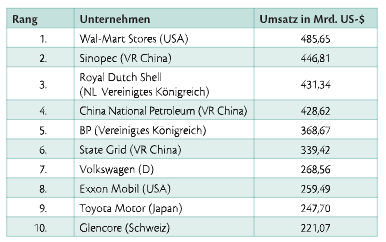
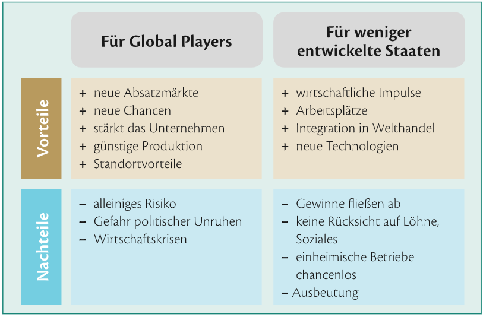
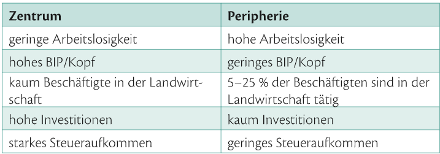

## 10.2 Global Players, S.214
### Global Player:
 - **Große Unternehmen**
   - viele Mitarbeiter
   - hohen Gewinn/Umsatz
   - mind. 2 Länder eine Niederlassung
 - werden auch TNU (Transnationales Unternehmen)
 - führende Rollen
   - Erdöl/Erdgas -Unternehmen
   - Automobilbranche
 - **anzahl** der Global Player **steigt immer mehr**
 - Gewinnmaximierung im Vordergrund
 - dominierende Stellung in der Weltwirtschaft
   - 2/3 weltwweiter waren/Dienstleistungen kommen von TNU's 
   - 3 der größten TNU's in China
   - **Top 10:**
    
- **Ziele der Global Player's:**
  - **Tochtergesellchaften**
    - um Vorteile in andern Ländern zu nutzen
      - CO2 emissions Vorschriften
      - mindestlohn
      - Wissen
      - billige Rohstoffe
        - -> Produkte billig auf den Markt bringen
    -  China beliebtes Land für Tochtergesellchaften:
    - von 80 Mio Beschäftigten 16Mio in China
    - lernen den lokalen Markt kennen
  - **wirtschaftliche interessen:**
    - F**usionen/Übernahmen** marktposition weiter ausbauen
      - dadruch haben Global Players ein "Imperium aufgebaut"
        - 2015 entsprach der Umsatz von Royal Durch Shell mit 431Mrd. US-$ den Österreichischem Bruttonationalprodukt
    - Monopol
    - **politischen Einfluss**
      - teilweise mächtiger als manche staaten
      - **-> wirtschaftliche Vorteile**
- **Vorteile/Nachteile:**
     
  - Probleme in wenig entwickelten Staaten werden oft bewusst nicht abgeschafft um Sie weiterhin ausnutzten zu können.
    - Kontrolle der Global Players durch: 
      - Eingriff durch den Staat
      - Staatenbündnisse
      - Informationskampagnen
      - Internationale Organisationen
        - UNO
        - WTO
        - IWF
        - Weltbank
      - Überprüfung durch Industrienationen
      - größte Kontrollinstanz Konsumenten, Konzerne haben Angst vor
        - Verbraucherboykotte
        - Demonstrationen
        - Shit Storm
        - negative Berichte
- **Global Compact:**
  - 2000 von UNO ins leben gerufen
  - Es geht darum das möglichst Viele unternehmen folgendes Unterschreiben:
    - **Akzeptanz der Menschenrechte**
    - **soziale Grundrechte**
    -  **Verhinderung von Kinderarbeit**
    -  **Verhinderung von Diskriminierung**
    -  **Umweltschutz**
    -  **Kampf gegen Korruption.**
 - Es gibt keinerlei kontrollinstanz oder Sanktionen, nur ein jährlicher Fortschirtsbericht (der wird allerdings nicht geprüft)
 - wird von vielen genutzt um greenwashing zu betreiben
 - bsp. Unternehmen welche das unterschrieben haben
   - Exxon Mobil
     - Lobbying: 2006: unterstützt Verleugnung von Klimawandel
     - gegen den Klimaschutz eingesetzt
     - Öltankerkatastrophe
       - Strafzahlung von mehreren Mrd. € wurde juristisch bekämpft und verzögert
     - Menschenrechte
       - Konzern unterstützt staatliche Armee finanziell um ungehindert ein Gasfeld auszubeuten
   - OMV
     - wird für geplante Ölborungen kritisiert
     - aber verbessert sich seid Sie dabei sind und sind offen im bezug auf den Bericht

## 10.3 Internationale Organisationen, S. 220
### Internationale Organisationen (IO) im Bereich der Wirtschaft und ihre Gegner

- **OECD:**
  - Organisation of Economic Cooperation and Development
  - vor 1961 OEEC
  - Quelle für Wirtschaftsdaten
    - bekanntgabe von volkswirtschaftlichen Kennziffern
    - Messung von Kompetenzen im Schulbereich (PISA-Studie)
  - Kritik: 
    - vertreter einer neoliberalen Wirtschafts und Gesellschaftstheorie
    - Sie orientiert sich and vorstellungen des freien Marktes
      - vergleiche für alle bereiche des lebens
    - hinter der OECD stehen wohlhabnede Volkswirtschaften
- **G7(8)-G20-G33**
  - Gruppen von Staaten um gemeinsame Interessen zu vertreten
  - G7(8)
    - Mitglieder:
      - Deutschland
      - Frankreich
      - Großbritannien
      - Italien
      - Japan 
      - Kanada
      - USA
    - Zusammenkommen (Weltwirtschaftsgipfel) zur Erörterung der weltwirtschaftlichen Lage
    - verbindliche Entscheidungen werden NICHT getroffen
  - G20:
    - gibt es in 2 Formen
      - 1. führende Industrie und Schwellenländer aus der EU (19 Mitglieder)
        - Kooperation in internationalen Finanzfragen
      - 2. führende Entwicklunsgländer und Schwellenländer (20 mitglieder)
        - WTO verhandlungen, sie fordern
          - andere Art der Agrarpolitik in der EU und den USA
          - senkung von Argarförderungen
          - aufheben von importbeschränkungen
  - G33:
    - Entwicklungsländer
    - Forderungen gleichen jenen der G20
- **IWM(IMF):**
  - der internationale Währungsfonds
  - Kriseninterventionssystem 
    - mit der EU-Kommision
    - und der Europähischen Zentralbank
  - wurde 1944 infolge der Finanzkrise 1930 gegründet zur Euro Rettung in Bretton Woods
    - Bretton Woods:
      - Die Siegermächte des zweiten Weltkriegs schloosen in Bretton woods einen Vertrag zur internationalen Währungsordnung. (US-$ wurde zur Leitwährung erklärt und an Gold gekoppelt)
      - Bis 1973 System von Bretton Woods aufrecht
        - fixer Wechselkurs mit bestimmten Schwankungsbreiten
        - garantierte Konvertibilität der Währungen
        - Nach dem scheitern von Bretton Woods -> IWF Kreditvergabe an Schwellenländer
  - soll Krisen durch Förderungen verhindern (Griechenland)
  - geförderte Länder müssen sparmasnahmen einleiten
  - Mehrheitsverhältnisse im Founds werden durch quoten bestimmt
    - Sie regeln die einzahlungspflicht
    - Industriestaaten haben großen Einfluss
      - Es wird eine gerechte verteilung sder stimmer gefordert
- **WTO:**:
  - 161 Mitgliedsstaaten
  - Regelt Verinbarungen zu internationalen Handelsverkehr:
    - Zollabbau
    - nichttarifäre Handelshemmnisse
    - Verbesserung des Marktzugangs für Waren und Dienstleistungen
    - veterinärrechtliche und pflanzenschutzrechtliche Maßnahmen
    - Ursprungsregeln und Einfuhrlizenzen
    - zwischenstaatliche und regionale Abkommen
    - Schutz geistiger Eigentumsrechte
    - '1) Meistbegünstigung und 2) Inländerbehandlubng sind pflicht für Mitgliedsstaaten:
      - 1) Jeder Handelsvorteil den man einem Staat gibt muss anderen auch gewährt werden.(Ausnahme: Zollunionen, Freihandelszonen)
      - 2)  ausländische Unternehmen und deren Produkte gleiche rechte wie inländischen unternehmen.
  - Besteht aus 3 wichtigen Abkommen
    - 1. GATT:
      - Gerneral Agreement on Traffis and Trade
      - Abbau von Zöllen für Industrie und Agrargüter
    - 2. GATS:
      - Gerneral Agreement on Trade in Services
        - Abbau von Vorschriften internationalen Handel mit Dienstleistungen.(Banken, Versicherungen, ...)
    - 3. TRIPS:
      - Trade-related Aspect of Intellectual Property Rights
        - alle formen geistigem Eigentum einer regulierung zu unterwerfen. (Patente, Medikamente, Marken)

- **Weltbankgruppe:**
  - besteht aus mehreren Organisationen, im Sprachgebrauch Weltbank
  - ursprung: Staaten nach dem 2.Weltkrieg finanziel beim aufbau helfen
  - Aufgabe heute:
    - Unterstützung von Less- & Least Developed Coutries
    - durch Finanzierung und Absicherung von Entwicklungsprojekten
    - stark verschuldete Länder werden entschuldet
- **WEF:**
  - World Economic Forum
  - jährlicher Treffpunkt für globale Wirtschafttreibende und vertreter internationaler Politik
  - Ktitik: ärmsten Länder sind nicht vertreten
- **Protestbewegung - NGOs**
  - Nichtregierungsorganisationen (NGOs)
  - teile der Gewerkschaftsbewegung, kirchliche organisationen, ...
  - richten Kritik gegen die IO's
  - begleitet die IO-Treffen
  - Ziele:
    - Kritk am System des Kapitalismus
    - Abschaffung steueroasen
    - gegen ungezügelten Freihandel
    - regulierung der wirtschaft
    - demokratische Kontrolle der Finanzmärkte
    - Kritik an der IWF, Weltbank usw.
    - demokratische Kontrolle der IO's
    - Ende von Privatisierung,  Deregulierung
    - Globalisierung als Ursache für Armut, Umweltzerstörung stoppen
- **ATTAC**
  - NGO
  - 50 Ländern als Mitglieder
  - Ziele:
    - kontrolle internationale Finanzmärkte
    - fordert eine globale Finanztranksaktionssteuer
- **WSF**
  - Weltsozialforum
    - gegenveranstalltung zu den treffen der WTO, WEF, G8
    - kritiker der globalisierung

## 10.4 Wirtschaftsbündnisse, S. 225
- **Regionalismus trotz Globalisierung**
  - Regionalismus: gegenseitige außenhandelspolitische Vorzugsbehandlung von Ländern einer Region
  - Ziel der zusammenschlüsse:
    - Wirtschaftswachstum durch Handelserleichterungen
    - politische Stabilität
  - **Bündnisse:**
    - **NAFTA:**
      - North American Free Trade Agreement
      - gründung 1994 als Freihandelszone
      - verschlechtert die Wettbewerbssituation für Mexikanische Bauern
        - USA fördert ihre Landwirtschaft Mexiko kann da mit den preisen nicht mithalten
        - USA exportiert dann nach Mexico und verkauft dort billig
      - Maquiladoras:
        - Fabriken im mexikanischen Grenzraum zu den USA
          - billige Arbeitskräfte
          - schlechte bedingungen
          - vor allem Frauen beschäftigt
        - US-Betriebe liefern Vorprodukte nach Mexico
        - lassen dort billig  produzieren und importieren wieder in die USA
  - **MERCOSUR:**
    - Mercado Comun del Sur
    - gründung 2000
    - Zollunion Südamerika
      - freier Verkeht von Waren und Dienstleistungen
    - Wichtigster Handelsparnter EU
  - **ASEAN:**
    - Association of Southeast Asian Nations
    - besteht aus mehreren Organisationen
    - AFTA (ASEAN Free Trade Ares) Freihandelszone
      - mitgliedstaaten sind von ihrer politik & ökonomie sehr unterschiedlich
      - Ziele der AFTA:
        - Zollabbau
    - Gründung aufgrund der Asienkrise
    - APEC:
      - Viele ASEAN-Staaten gehören der APEC an
        - Asia-Pacific Economic Cooperation
        - Ziel: Freihandelszone im pazifischen Raum
  - **ECOWAS, COMESA:**
    - Wirtschaftsbündniss Afrika
    - Vorbild ist die EU
    - Problem:
      - afikanische Staaten politisch oft uneinig
    - größten Vereinigungen:
      - ECOWAS: Economic Community of west African States
      - COMESA: Common Market for Eastern and Southern Africa
      - SADC: Southern African Development Community
  - **OPEC:**
    - Organisation erölecportierender Länder
    - Sitz in Wien
    - 12 Mitgliedstaaten
    - legen die Erdölmengen fest, einfluss auf entwicklung des Ölpreises
    - besitzten etwa 80% der weltweiten Erölreserven
  - **Handelskriege:**
    - wirtschafliche Handelsmaßnahmen zwischen Staaten/Bündnissen
    - Gründe:
      - eigene Bereiche der wirtschaft schützen
      - gegen Dumping (=Verkauf von Ware zu nicht kostendeckenden Preisen)
  - Bsp.:
    - EU Bananenimporte:
      - EU bevorzugte Bananen aus afrika, karibischen und pazifischen Staaten
      - EU benachteiligte südamerikansche Grosecporteure

## 13.2 Regionalpolitik in der EU, S. 288
- **Lebensbedingungen in Eurpoa sehr unterschiedlich**
  - mittel/osteuropa viele Dörfer, wenig infastruktur
  - andere länder die wohlhabensten der Welt
  - Gründe:
    - geografische Lage
    - Altlasten kommunistischem Erbes
    - wirtschaftliche & soziale Umbrüche
- **EU ist in Regionen geteilt**
  - bedeutung gering
  - Ausschuss der Regionen
    - 350 Mitglieder lokal, Regionalpolitiker
    - nur beratende Funktion
  - Subsidiarität
    - öffentliche Aufgaben möglichst bürgernah regeln
    - grentzt Kompentenzen von EU, Nationalstaat, Länder & Regionen ab
  - Zenrtum vs Perpherie
    
  - Europhäische Regionalpolitik versucht ungleichheiten auszugleichen
    - 
- **NUTS-Regionen**
  - Ist eine Einteilung in Regionen
    - **NUTS1:** größere Landteile oder Regionen
    - **NUTS2:** mittlere Regionen  
    - **NUTS3:** kleinere Regionen
- **EU unterstützt Regionen** wie hoch diese ist höngt ab ob man
  - **"weniger entwicklete Regionen"**: BIP 75%des Durchschnitt der EU
  - **"Übergangsregionen":** BIP 75% bis 90% des Durchschnitt der EU
  - **"Stärker entwickelte Regionen":** BIP 90% des Durchschnitt der EU
- **Ziele der EU**
  - Beschäftigung:
  - Forschung & entwicklung
  - Klimawandel & nachhaltige energie
  - Bildung
  - Armutsbekämpfung
- **Gelder der Finanzierung**
  - Der Europäische Fonds für regionale Entwicklung
    - investitionen für Forschung & Entwicklung
    - Co2 arme wirtschaft
    - 50% der mittel in städtische Gebiete
  - Der Europäische sozialfond
    - investiert in aus- und weiter bildungen
    - Verbesserung der Beschäftigungs-, Bildungschancen
  - Kohäsionsfound:
    - Umwelt, Verkehr, erneuerbare Energie
  - EU Förderprogramme
    - URBACT: 
      - EU-Förderprogramm für nachhaltige Sadtenwicklung
    - LEADER:
      - Programm zur Entwicklung des ländlichen Raums
    - INTERREG V:
      - Grenzüberschreitende Zusammenarbeit
      - transfer von Know-how
      - Alpemkonvention
        - völkerreichlicher Übereinkommen zwischen den Alpenstaaten zur nachhaltigen Entwicklung